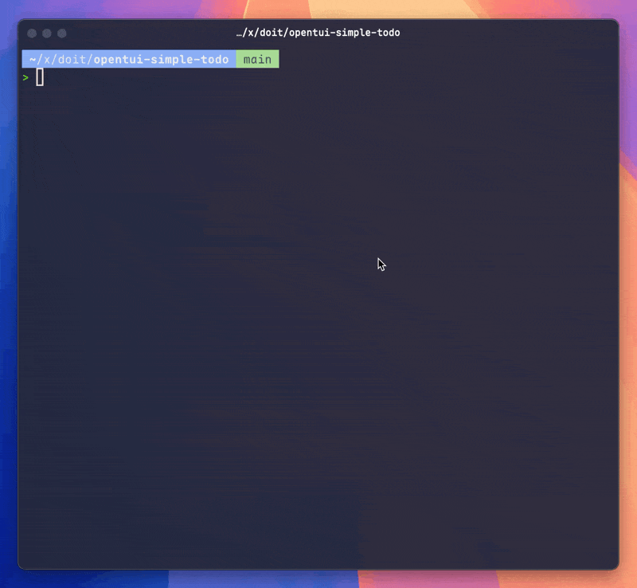

# 🚀 TODO TUI App

<div align="center">
A beautiful terminal-based TODO manager built with OpenTUI and React.

  



</div>

## Features

- ✅ **Beautiful Terminal UI** - Modern TUI with colorful borders and intuitive layout
- ⌨️ **Keyboard-Driven** - Full keyboard navigation and shortcuts
- 🎯 **Smart Filtering** - Filter TODOs by All, Active, or Completed
- 💾 **State Management** - React Context API for clean state management
- 🎨 **Component-Based** - Modular architecture with reusable components
- 📝 **Full CRUD** - Create, Read, Update (toggle), Delete TODOs

## Installation

```bash
bun install
```

## Usage

### Run the app:

```bash
bun run src/index.tsx
```

### Development mode (auto-reload):

```bash
bun run dev
```

## Keyboard Shortcuts

### Welcome Screen
- `L` - View TODO List
- `C` - Create New TODO (opens list with input focused)
- `ESC` - Exit Application

### TODO List Screen

#### When Input is Focused (default)
- Type to enter TODO text
- `Enter` - Submit new TODO
- `Tab` - Switch to list focus

#### When List is Focused (press Tab)
- `↑` / `K` - Navigate up in TODO list
- `↓` / `J` - Navigate down in TODO list
- `Space` / `Enter` - Toggle TODO completion
- `D` / `Delete` - Delete selected TODO
- `1` - Show All TODOs
- `2` - Show Active TODOs only
- `3` - Show Completed TODOs only
- `Tab` - Switch back to input focus

#### Global (any focus)
- `ESC` - Back to Welcome Screen

## Project Structure

```
src/
├── index.tsx              # Main entry point + App component
├── types/
│   └── index.ts          # TypeScript type definitions
├── contexts/
│   └── AppContext.tsx    # Global state management with Context API
└── components/
    ├── WelcomeScreen.tsx     # Welcome screen with navigation options
    ├── TodoListScreen.tsx    # Main TODO list screen
    ├── Header.tsx            # App header with title and stats
    ├── TodoInput.tsx         # Input field for creating TODOs
    ├── FilterTabs.tsx        # Filter tabs (All/Active/Completed)
    └── TodoList.tsx          # TODO items list with navigation

docs/
└── OPENTUI_REFERENCE.md  # OpenTUI React API reference
```

## Architecture Highlights

### State Management
- **React Context API** for global state
- Custom hooks (`useAppContext`) for easy access
- Clean separation of concerns

### Component Design
- **Functional Components** with React Hooks
- **Modular Architecture** - each component has a single responsibility
- **TypeScript** for type safety

### OpenTUI Features Used
- `<box>` - Layout containers with flexbox
- `<text>` - Styled text rendering
- `<input>` - Interactive input fields
- `useKeyboard` - Keyboard event handling
- Custom styling with borders, colors, and padding

## Tech Stack

- **Runtime**: Bun
- **UI Framework**: OpenTUI React v0.1.36
- **React**: 19.1.1
- **Language**: TypeScript with strict mode
- **Layout Engine**: Yoga (Flexbox for terminals)

## Color Scheme

- **Primary**: Blue backgrounds
- **Accents**: Cyan borders, Yellow highlights
- **Success**: Green for completed items
- **Info**: Gray for hints and metadata
- **Danger**: Red for exit actions

## Code Quality

- ✅ TypeScript strict mode enabled
- ✅ No compilation errors
- ✅ Clean component architecture
- ✅ Consistent code style
- ✅ Comprehensive documentation

## Documentation

- See [docs/OPENTUI_REFERENCE.md](docs/OPENTUI_REFERENCE.md) for complete OpenTUI API reference
- See [CLAUDE.md](CLAUDE.md) for project guidelines and conventions

## References

- [OpenTUI Repository](https://github.com/sst/opentui/tree/main)
- [OpenTUI Getting Started](https://github.com/sst/opentui/blob/main/packages/core/docs/getting-started.md)
- [OpenTUI Examples](https://github.com/sst/opentui/tree/main/packages/core/src/examples)
- [OpenTUI React Documentation](https://github.com/sst/opentui/blob/main/packages/react/README.md)

## License

This project was created using `bun create tui`. [create-tui](https://git.new/create-tui) is the easiest way to get started with OpenTUI.

---

**Happy Terminal TODO-ing! 🎉**
